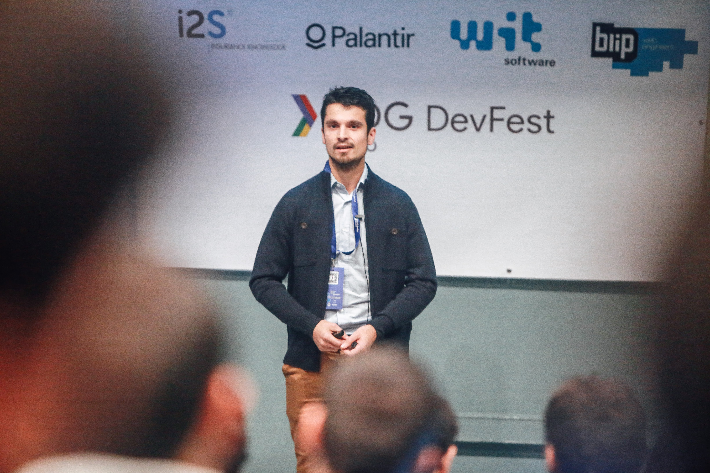
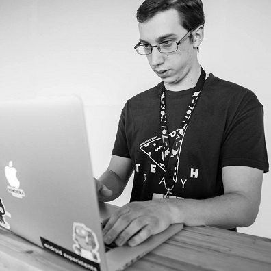
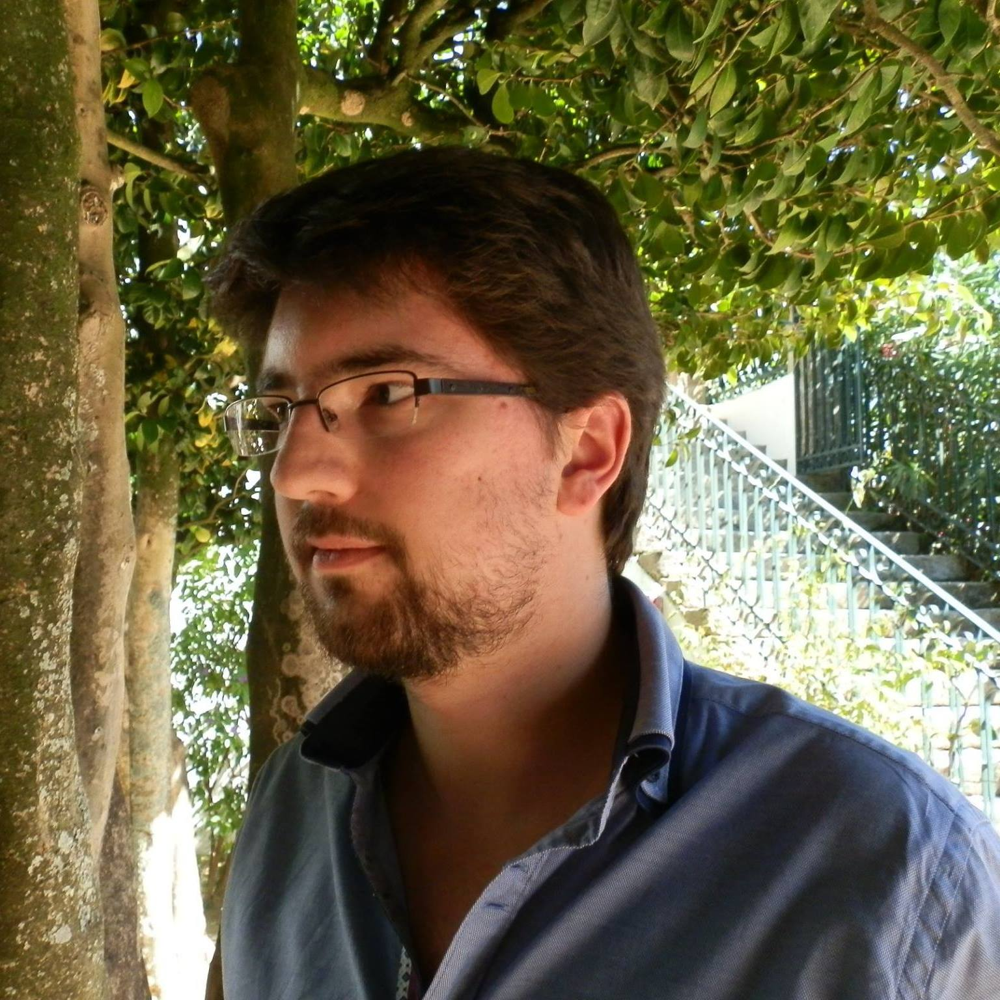

# About

A group of friends that decided to contribute to the community by starting to organize events where we could gather everyone interested in all the topics regarding testing. We start with one or two presentations and then discuss these and other themes afterwards along with a coffee break provided by the host company.
Check our events <a href="https://portotestersmeetup.eventbrite.com" target="_blank">here</a>.

# Team

<table width="100%" height="100%" style="border: 1px solid transparent">

  <tr>
    <td class="column">
      

        
        

          
Diogo Júnior

        

      

    </td>

    <td class="column">
      

        
        

          
Fábio Barbosa

        

      

    </td>
    
    <td class="column">
      

        
        

          
Filipe Carvalho

        

      

    </td>
    
    <td class="column">
      

        
        

          
Nuno Matos

        

      

    </td>
  </tr>
  
</table>

  
Diogo Júnior, Engenheiro da FEUP, começou a trabalhar no Instituto de Investigação Fraunhofer Portugal. Depois de 5 anos no mundo da investigação, mudou para o mundo empresarial e participou na equipa mobile de e-commerce na Porto Tech Center. Neste momento encontra-se na 7Graus onde é atualmente Lead Android - Full Stack Dev - ASO Expert.

  
Licenciado em Engenharia de Informática no Instituto Superior de Engenharia do Porto. Começou como web tester mas já trabalha há algum tempo como Test Automation Engineer na área de Mobile. Sempre com vontade de aprender mais e a melhorar a comunidade. Participa em vários eventos, seja para simplesmente ir aprender como para ajudar na organização ou dar uma palestra. Actualmente a trabalhar na Farfetch como Mobile Test Automation Engineer.

  
Após ter concluído o Mestrado Integrado em Engenharia Informática na FEUP, começou a sua carreira como developer, tendo algum tempo depois decidido explorar e enveredar pelas áreas de Mobile Test & Delivery Automation tendo naturalmente evoluído para Test Lead durante o seu percurso. Continua muito interessado em continuar a evoluir, sendo presença constante em eventos da área, nomeadamente relacionados com Testing, Delivery ou Infrastructure Automation. É neste momento Senior Test Automation Engineer do cluster de Mobile na Farfetch.

  
Licenciado em Informática de Gestão e 19 anos de experiência profissional em IT onde em 2008 enveredou na área de Testing e sua carreira progrediu naturalmente de junior a QA Team Lead seguido de Test Manager. Actualmente o seu desafio é de implementar test strategy, processos e procedimentos na entrega de produtos web na VentureOak com os padrões de qualidade elevados.

# Call for Speakers

We are always looking for speakers for these events. If you want to talk and share some of your knowledge, please let us know and fill <a href="/PTM_PAGE/pages/CFS">this small form</a>

# Want to contribute to the website?

Great! Please follow our instructions <a href="https://github.com/portotestersmeetup/PTM_PAGE" target="_blank">here</a>. If you just want to host an event or share any idea, just talk to anyone in the organization on <a href="https://portotestersmeetup.slack.com" target="_blank"> slack</a> (join us if haven't already <a href="https://slackvite.com/portotestersmeetup" target="_blank"> here</a>) or in our <a href="https://www.facebook.com/groups/PortoTestersMeetup/" target="_blank"> facebook group</a>.

# Next Event

<iframe  src="https://www.eventbrite.pt/calendar-widget?eid=37305787615" frameborder="0" height="487" width="195" marginheight="0" marginwidth="0" scrolling="no" allowtransparency="true"></iframe>
<a class="powered-by-eb" style="color: #ADB0B6; text-decoration: none;" target="_blank" href="http://www.eventbrite.pt/">Desenvolvido pela Eventbrite</a>

